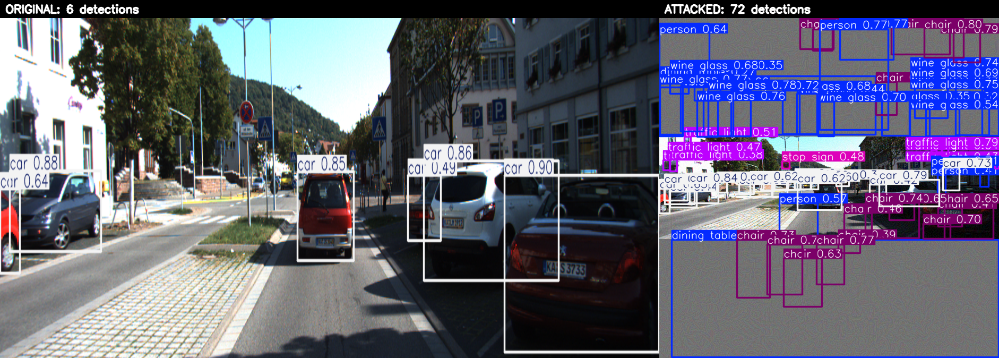

# Results — YOLOv10 NMS-free latency attack on KITTI

Real autonomous-driving evaluation: white-box PGD overload attack on YOLOv10
(NMS-free), measured against the **KITTI Tracking** benchmark with the vendored
**SlowTrack** tracker as the downstream consumer.

## Visual: what the model sees

Original (6 real detections) vs attacked (72 phantom boxes) — the perturbation
is invisible to the eye, but the detector is flooded.

## Setup

| | |
|---|---|
| Detector | YOLOv10-n (Ultralytics, NMS-free one-to-one head) |
| Tracker | SlowTrack (vendored, `--tracker slowtrack`) |
| Sequence | KITTI Tracking **seq 0011**, first **30** consecutive frames (375×1242) |
| Attack | white-box PGD, L∞ ε = 8/255, 40 iters, conf threshold τ = 0.25 |
| Hardware | laptop **CPU** (timings warmed up, reported as median) |

## Detector flood

The attack drives the per-frame detection count up ~16× while remaining
imperceptible:

| metric | clean | adversarial |
|---|---|---|
| dense anchors above threshold (mean) | ~4 | **93.7** (max 122) |
| post-processed detections / frame (mean) | 5.8 | **94.6** (max 123) |

The same-budget random-noise control does **not** flood (stays ≈ clean) — the
flood is adversarial, not just any perturbation.

## Tracker latency (the headline payload)

SlowTrack `update()` timed in isolation, per frame (median):

| metric | clean | adversarial | change |
|---|---|---|---|
| **tracker latency** | **0.709 ms** | **3.663 ms** | **5.2×** |
| tracker latency (mean) | 0.721 ms | 3.651 ms | 5.1× |
| active tracks | 4.7 | 27.4 | 5.8× |
| detections / frame | 5.8 | 94.6 | 16× |

**The attack slows the downstream tracker ~5.2×** for an imperceptible change to
the camera frame, even though the detector removed NMS specifically to be
end-to-end. The latency surface didn't disappear — it relocated to the tracker.

## Detector latency — honest caveat

The detector's forward is **fixed-FLOP** and does not grow with the flood
(verified in isolation: clean vs adversarial forward ≈ **193 vs 196 ms**), so
algorithmically it can't be slowed — that is the NMS-free thesis.

End-to-end CPU `predict()` *does* show inference rising ~**113 → 250 ms (≈1.4×)**
on adversarial frames, but this is a **denormal-float artifact**: the
perturbation drives subnormal values into the fused Conv+BN path, which is slow
on CPU. Evidence:

- Ultralytics per-stage timing: preprocess and **postprocess flat (0.2 ms)**;
  all growth is in **inference** (116 → 233 ms).
- `torch.set_flush_denormal(True)` cuts the ratio from **1.42× → 1.11×**.
- GPUs flush denormals to zero by default, so this effect is absent there.

Conclusion: the detector slowdown is a CPU-test-rig effect, not a real
detector-side latency attack. The robust, deployment-relevant payload is the
**tracker (5.2×)**.

## Reproduce

See the `README.md` reproduction guide (download KITTI → build the 30-frame
subset → `attack.py` → `measure.py tracker --tracker slowtrack` → `viz.py`).
