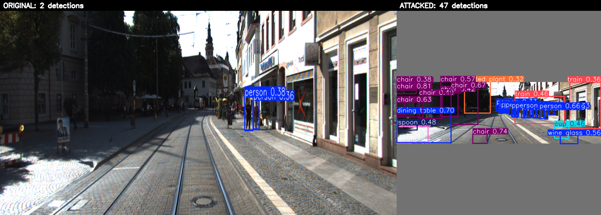
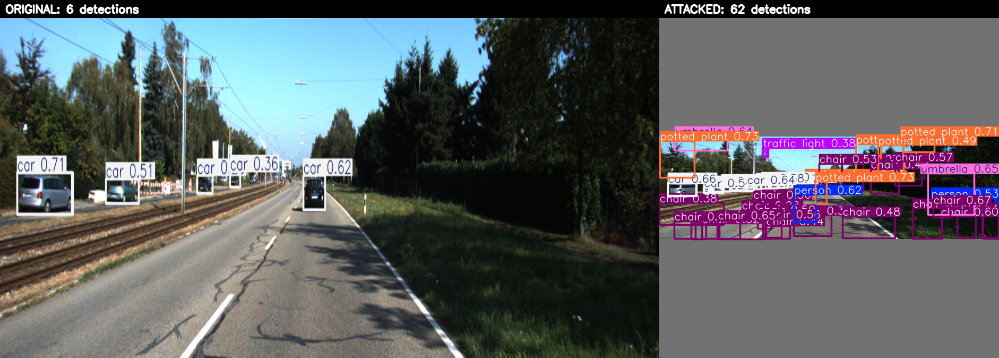
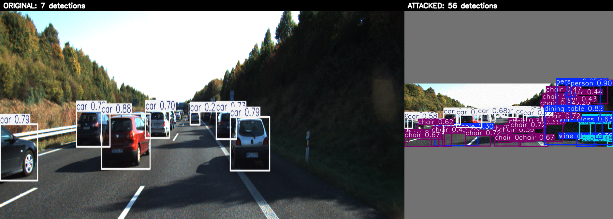

# Results — YOLOv10 NMS-free latency attack on KITTI

Real autonomous-driving evaluation: white-box PGD overload attack on YOLOv10
(NMS-free), measured against the **KITTI Tracking** benchmark with the vendored
**SlowTrack** tracker as the downstream consumer. Evaluated on four sequences
spanning a range of clean detection counts (few to many objects per frame; seq
0011 below is the detailed walkthrough, with the four-clip summary further down).

## Visual: what the model sees

Original (6 real detections) vs attacked (50 phantom boxes) — the perturbation
is invisible to the eye, but the detector is flooded. Note the phantom boxes are
confined to the **scene content**; the grey letterbox padding is left clean
(see the threat-model note below).

## Setup

| | |
|---|---|
| Detector | YOLOv10-n (Ultralytics, NMS-free one-to-one head) |
| Tracker | SlowTrack (vendored, `--tracker slowtrack`) |
| Sequences | KITTI Tracking seqs **0011, 0005, 0013, 0020**, first **30** frames each (375×1242) |
| Attack | white-box PGD, L∞ ε = 8/255, 40 iters, conf threshold τ = 0.25 |
| Threat model | perturbation + loss masked to the **scene-content region** |
| Hardware | laptop **CPU** (timings warmed up, reported as median) |

## Threat model — content-region only

The perturbation and the flood loss are restricted to the **scene-content
region**, excluding the grey letterbox padding that the preprocessing pipeline
inserts to make the wide frame square. A real camera attacker controls the
scene, not that inserted padding, so flooding it would be un-realizable.

Without the mask, the same setup reads `5.8 → 94.6` detections and a `5.2×`
tracker multiplier — but **~45% of that flood was padding detections** a camera
attacker could never produce. The content-only numbers below are the honest,
deployment-realistic result.

## Detector flood

The attack drives the per-frame detection count up ~9× while remaining
imperceptible:

| metric | clean | adversarial |
|---|---|---|
| dense anchors above threshold (mean) | ~5 | **51.4** (max 69) |
| post-processed detections / frame (mean) | 5.8 | **51.7** (max 69) |

The same-budget random-noise control does **not** flood (stays ≈ clean) — the
flood is adversarial, not just any perturbation.

## Tracker latency (the headline payload)

SlowTrack `update()` timed in isolation, per frame:

| metric | clean | adversarial | change |
|---|---|---|---|
| **tracker latency (median)** | **0.684 ms** | **2.136 ms** | **~3.1×** |
| tracker latency (mean) | 0.911 ms* | 2.104 ms | 2.3× |
| active tracks | 4.7 | 17.5 | 3.7× |
| detections / frame | 5.8 | 51.7 | ~9× |

\* the clean mean is inflated by a single first-frame outlier; the **median** is
the robust figure, hence the ~3.1× headline.

**The attack slows the downstream tracker ~3.1×** for an imperceptible,
camera-realizable change to the frame, even though the detector removed NMS
specifically to be end-to-end. The latency surface didn't disappear — it
relocated to the tracker.

## Across four KITTI clips

The same attack and measurement on four different KITTI sequences (30 frames
each, SlowTrack, median):

| seq | clean det/frame | adv det/frame | tracker clean ms | tracker adv ms | multiplier |
|---|---|---|---|---|---|
| 0013 | 2.4 | 46.9 | 0.517 | 1.875 | **3.6×** |
| 0005 | 3.4 | 53.5 | 0.543 | 2.12  | **3.9×** |
| 0011 | 5.8 | 51.7 | 0.684 | 2.136 | **3.1×** |
| 0020 | 6.7 | 41.5 | 0.684 | 1.74  | **2.5×** |

The effect holds across all four clips (**2.5–3.9×**). The multiplier is *larger
when the scene starts with fewer real objects*: the flood saturates at a similar
absolute level (~42–53 detections) no matter how many objects the scene starts
with, so a clip with a low clean detection count — and thus a tiny clean tracker
baseline — sees the biggest relative jump, while a busier clip already keeps the
tracker working and has less headroom.

Comparison images (frame 000010; original vs attacked, boxes the model's own
predictions, perturbation invisible, flood confined to the scene content):

**seq 0013 (2 → 47 detections)**

**seq 0005 (6 → 62 detections)**

**seq 0020 (7 → 56 detections)**

## Detector latency — honest caveat

The detector's forward is **fixed-FLOP** and does not grow with the flood
(verified in isolation: clean vs adversarial forward ≈ **193 vs 196 ms**), so
algorithmically it can't be slowed — that is the NMS-free thesis.

End-to-end CPU `predict()` *does* show inference rising (~**106 → 229 ms** here),
but this is a **denormal-float artifact**: the perturbation drives subnormal
values into the fused Conv+BN path, which is slow on CPU. Evidence:

- Ultralytics per-stage timing: preprocess and **postprocess flat (0.2 ms)**;
  all growth is in **inference**.
- In a controlled same-frame test the denormal-attributable slowdown is ≈1.4×,
  and `torch.set_flush_denormal(True)` cuts it to ≈1.1×.
- GPUs flush denormals to zero by default, so this effect is absent there.

Conclusion: the detector slowdown is a CPU-test-rig effect, not a real
detector-side latency attack. The robust, deployment-relevant payload is the
**tracker (~3.1×)**.

## Reproduce

See the `README.md` reproduction guide (download KITTI → build the 30-frame
subset → `attack.py` → `measure.py tracker --tracker slowtrack` → `viz.py`).
